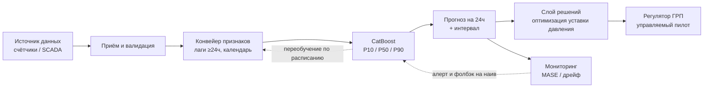

# Energy Load Forecasting (day-ahead)

> Прогноз почасового потребления электроэнергии на 24 часа вперёд.
> Модель CatBoost вдвое точнее сезонного наива: **MAPE 4.6 % против 9.1 %, MASE 0.52**.

---

## Задача и мотивация

Энергосистемы и распределительные сети должны заранее знать, сколько ресурса
понадобится завтра: от этого зависит резерв мощности и режим работы.
Здесь решается задача **day-ahead**: предсказать потребление на каждый из
следующих 24 часов, причём не одним числом, а с интервалом неопределённости.

Мотивация — из инженерной области газораспределения (тема ВКР автора, транспорт
газа). Сеть низкого давления питается от головного ГРП, который понижает давление
с высокого на среднее. Сегодня уставка держится фиксированной «с запасом» под
редкий пик — а это круглосуточные потери (утечки растут с давлением). Если
**прогнозировать спрос**, уставку можно опускать в провалах и поднимать заранее
перед пиком. Реальных почасовых данных по газовой сети в открытом доступе нет,
поэтому методология демонстрируется на открытом ряде потребления электроэнергии;
конвейер прогноза полностью переносится на газовый спрос, где главный драйвер —
температура (см. «Ограничения»).

---

## Данные

[PJM Hourly Energy Consumption](https://www.kaggle.com/datasets/robikscube/hourly-energy-consumption),
ряд **AEP** (American Electric Power): ~121 000 часов, **2004–2018 (≈14 лет)**,
потребление в МВт.

Данные не хранятся в репозитории (большой объём). Чтобы воспроизвести: скачать
`AEP_hourly.csv` по ссылке выше, положить рядом со скриптами и запустить конвейер
(см. «Запуск») — производные файлы создадутся сами.

---

## Метод

Конвейер из пяти шагов:

1. **Очистка** (`01_load_and_clean.py`). Ряд приходит неотсортированным и с
   артефактами перехода на летнее время: дубли меток (осень) и пропуски (весна).
   Сортируем, усредняем дубли, строим непрерывную часовую сетку, 27 пропусков
   заполняем значением того же часа неделю назад, помечая их флагом.
2. **Признаки** (`04_features.py`). 14 признаков трёх типов: календарные
   (час, день недели, месяц), циклические (sin/cos часа и дня года), лаги и
   скользящие. **Ключевое решение — защита от утечки:** все лаги и окна сдвинуты
   минимум на горизонт (24 ч), потому что на момент прогноза данные свежее 24 ч
   ещё неизвестны.
3. **Валидация** (`03_validation.py`). Оценка на **бэктесте со скользящим
   началом** (6 окон, обучение всегда строго до теста, без перемешивания).
   Эталон — **сезонный наивный прогноз** (тот же час неделю назад); метрика
   сравнения — **MASE** (во сколько раз лучше наива, <1 = лучше).
4. **Модель** (`05_model.py`). Градиентный бустинг **CatBoost**, оценённый на том
   же бэктесте. Выбран как сильнейший и быстрый вариант для табличных данных
   (нейросети выигрывают на сыром входе вроде изображений, не здесь).
5. **Интервалы** (`06_intervals.py`). Квантильная регрессия P10/P50/P90 — коридор
   неопределённости. Верхняя граница **P90** = резерв для расчёта мощности/давления.

---

## Результаты

Сравнение на 6 окнах бэктеста (среднее):

| Метрика | Сезонный наив | CatBoost |
|---|---|---|
| MAPE | 9.1 % | **4.6 %** |
| MASE | 1.01 | **0.52** |
| MAE | 1353 МВт | **692 МВт** |

CatBoost ошибается **вдвое меньше** бейзлайна, и улучшение стабильно во всех окнах.

**Важность признаков** даёт нетривиальный вывод: сильнее всего предсказывает
`lag_24` (тот же час вчера), а явные сезонные признаки (`month`, день года)
оказались почти бесполезны — **лаги уже впитали сезонность**, отдельный «месяц»
модели не нужен.

Интервал P10–P90 накрывает **~80 %** фактов — ровно столько, сколько и
закладывалось (это калибровка, а не ошибка): честный интервал, а не раздутый.


---

## ML System Design

В репозитории — исследовательское (offline) ядро. Ниже — как оно разворачивается
в рабочую систему. Здесь это описано как архитектура, а не реализовано: для
прототипа важнее доказать качество прогноза, чем строить инфраструктуру.



- **Приём данных.** В бою — поток с телеметрии/счётчиков сети; в прототипе —
  статический CSV. На входе валидация: пропуски, дубли, переход на летнее время
  (логика уже в `01_load_and_clean.py`).
- **Конвейер признаков.** Те же преобразования применяются к свежим данным.
  Критично сохранять правило анти-утечки и при онлайн-инференсе.
- **Обучение и переобучение.** Модель переобучается по расписанию (например, раз
  в неделю) на расширяющемся окне; внеплановый триггер — рост ошибки на свежих
  фактах.
- **Сервинг.** Батч day-ahead: ежедневно в фиксированный час — прогноз на
  следующие 24 ч с интервалом P10/P90, отдаётся в систему принятия решений (или
  по API).
- **Мониторинг и дрейф.** На приходящих фактах считаем MASE/MAPE; следим за
  дрейфом распределения входов (аномальная погода, смена режима сети); при
  деградации — алерт.
- **Фолбэк.** Если модель или данные недоступны либо прогноз невалиден — система
  откатывается на сезонный наив (он уже реализован как бейзлайн) как безопасный
  дефолт.
- **Слой принятия решений** (доменная связь с ВКР). Прогноз спроса (P50) и резерв
  (P90) кормят оптимизатор уставки давления на головном ГРП, которую отрабатывает
  управляемый пилот регулятора. Предохранительная автоматика (ПЗК/ПСК) независима
  и неизменна; алгоритм двигает уставку только внутри безопасного коридора.

---

## Ограничения и дальнейшая работа

- **Нет температуры** — главного физического драйвера спроса (и для газа ещё
  сильнее). В этом датасете её нет; добавление погоды — первый шаг к улучшению.
- **Нет признака праздников.** На тестовом окне модель промахнулась 4 июля
  (праздник США, низкая нагрузка), потому что про календарь праздников не знает.
- **Гиперпараметры не подбирались** — взяты разумные значения по умолчанию.
- **Один источник данных** — без отказоустойчивого приёма из нескольких точек.

---

## Запуск

```bash
# окружение
conda create -n energy-forecast python=3.11 -y
conda activate energy-forecast
pip install -r requirements.txt

# порядок запуска (нумерация = логика рассказа, не порядок исполнения)
python 01_load_and_clean.py     # очистка    -> aep_clean.csv
python 04_features.py           # признаки   -> aep_features.csv
python 03_validation.py         # бейзлайн
python 05_model.py              # CatBoost + важность признаков
python 06_intervals.py          # интервалы  -> forecast_intervals.png
```

Разведочный анализ — в ноутбуке `02_eda.ipynb` (запускать после `01`).

---

## Структура

```
.
├── utils.py                 # общие функции: метрики, бэктест, логгер
├── 01_load_and_clean.py     # загрузка и очистка ряда
├── 02_eda.ipynb             # разведочный анализ (графики)
├── 03_validation.py         # бэктест + сезонный наив (бейзлайн)
├── 04_features.py           # построение признаков
├── 05_model.py              # обучение CatBoost, сравнение с бейзлайном
├── 06_intervals.py          # квантильные интервалы P10/P50/P90
├── forecast_intervals.png   # результат: прогноз с интервалом
├── requirements.txt
└── README.md
```
