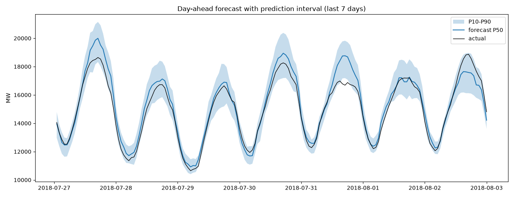
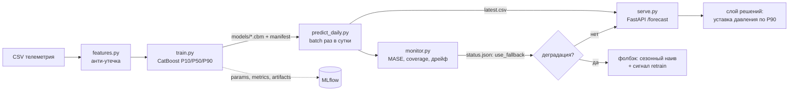

# Energy Load Forecasting (day-ahead)

> Прогноз почасового потребления электроэнергии на 24 часа вперёд.
> Модель CatBoost вдвое точнее сезонного наива: **MAPE 4.6 % против 9.1 %, MASE 0.52**.
> Многоузловая модель на 4 зоны + погода: **MAPE до 3.3 %**. Интерактивный дашборд показывает управление давлением.

---

## Задача и мотивация

Энергосистемы и распределительные сети должны заранее знать, сколько ресурса
понадобится завтра: от этого зависит резерв мощности и режим работы.
Здесь решается задача **day-ahead**: предсказать потребление на каждый из
следующих 24 часов, причём не одним числом, а с интервалом неопределённости.

Мотивация — из инженерной области газораспределения (тема ВКР автора, транспорт
газа). Сеть низкого давления питается от головного ГРП, который понижает давление
с высокого на среднее. Сегодня уставка держится фиксированной «с запасом» под
редкий пик — а это круглосуточные потери (утечки растут с давлением). Если
**прогнозировать спрос**, уставку можно опускать в провалах и поднимать заранее
перед пиком. Реальных почасовых данных по газовой сети в открытом доступе нет,
поэтому методология демонстрируется на открытом ряде потребления электроэнергии;
конвейер прогноза полностью переносится на газовый спрос, где главный драйвер —
температура (см. «Ограничения»).

---

## Данные

[PJM Hourly Energy Consumption](https://www.kaggle.com/datasets/robikscube/hourly-energy-consumption),
ряд **AEP** (American Electric Power): ~121 000 часов, **2004–2018 (≈14 лет)**,
потребление в МВт.

Данные не хранятся в репозитории (большой объём). Чтобы воспроизвести: скачать
`AEP_hourly.csv` по ссылке выше, положить рядом со скриптами и запустить конвейер
(см. «Запуск») — производные файлы создадутся сами.

---

## Метод

Конвейер из пяти шагов:

1. **Очистка** (`01_load_and_clean.py`). Ряд приходит неотсортированным и с
   артефактами перехода на летнее время: дубли меток (осень) и пропуски (весна).
   Сортируем, усредняем дубли, строим непрерывную часовую сетку, 27 пропусков
   заполняем значением того же часа неделю назад, помечая их флагом.
2. **Признаки** (`04_features.py`). 15 признаков: календарные
   (час, день недели, месяц, выходной, **праздник**), циклические (sin/cos часа и
   дня года), лаги (24/48/168) и скользящие. **Ключевое решение — защита от утечки:** все лаги и окна сдвинуты
   минимум на горизонт (24 ч), потому что на момент прогноза данные свежее 24 ч
   ещё неизвестны.
3. **Валидация** (`03_validation.py`). Оценка на **бэктесте со скользящим
   началом** (6 окон, обучение всегда строго до теста, без перемешивания).
   Эталон — **сезонный наивный прогноз** (тот же час неделю назад); метрика
   сравнения — **MASE** (во сколько раз лучше наива, <1 = лучше).
4. **Модель** (`05_model.py`). Градиентный бустинг **CatBoost**, оценённый на том
   же бэктесте. Выбран как сильнейший и быстрый вариант для табличных данных
   (нейросети выигрывают на сыром входе вроде изображений, не здесь).
5. **Интервалы** (`06_intervals.py`). Квантильная регрессия P10/P50/P90 — коридор
   неопределённости. Верхняя граница **P90** = резерв для расчёта мощности/давления.

**Расширения:**

6. **Многоузловая сеть** (`07_multinode.py`). Одна модель на 4 региона (AEP, COMED,
   DAYTON, DEOK) с категориальным признаком `region` — каждый регион это узел сети
   (аналог ГРПШ). Признаки строятся внутри узла, лаги не пересекают границы.
7. **Погода** (`09_multinode_weather.py`). Температура из открытого архива
   Open-Meteo — каждой зоне по своим координатам (разный климат). Крупнейший
   внешний драйвер спроса. Для day-ahead допустима (прогноз погоды существует) —
   не утечка, как календарь.

---

## Результаты

Сравнение на 6 окнах бэктеста (среднее):

| Метрика | Сезонный наив | CatBoost |
|---|---|---|
| MAPE | 9.1 % | **4.6 %** |
| MASE | 1.01 | **0.52** |
| MAE | 1353 МВт | **692 МВт** |

CatBoost ошибается **вдвое меньше** бейзлайна, и улучшение стабильно во всех окнах.

**Важность признаков** даёт нетривиальный вывод:

| Признак | Вклад |
|---|---|
| `lag_24` (нагрузка сутки назад) | **49 %** |
| `dayofweek` (день недели) | 16 % |
| `lag_168` (неделю назад) | 6 % |
| `is_weekend` | 6 % |
| `doy_cos`, `hour` (сезон, час) | ~5 %, ~3 % |
| `month`, `is_holiday`, скользящие, `lag_48` | ≤ 2 % каждый |

Половину силы несёт `lag_24`, а явные сезонные признаки (`month`, день года) почти
бесполезны — **лаги уже впитали сезонность**, отдельный «месяц» модели не нужен.

**Тюнинг гиперпараметров** (`10_tuning.py`: Optuna, 60 проб, 6 параметров —
learning_rate, depth, l2_leaf_reg, random_strength, subsample, rsm; early stopping
на временнОй валидации, verbose-лог по пробам). Подбор не превзошёл значения по
умолчанию (разница 1–3 %, в пределах шума между окнами): дефолты CatBoost на этих
данных близки к оптимуму — основной выигрыш дают данные и признаки, а не тонкая
настройка.

Интервал P10–P90 накрывает **~80 %** фактов — ровно столько, сколько и
закладывалось (это калибровка, а не ошибка): честный интервал, а не раздутый.

**Многоузловая модель** (одна на все 4 узла) бьёт сезонный наив на каждом узле:

| Узел | MAPE наив → модель | MASE наив → модель |
|---|---|---|
| AEP | 9.1 % → **4.7 %** | 1.01 → **0.52** |
| COMED | 10.7 % → **5.6 %** | 1.21 → **0.63** |
| DAYTON | 9.7 % → **5.3 %** | 0.98 → **0.54** |
| DEOK | 11.9 % → **7.0 %** | 1.06 → **0.60** |

AEP в общей модели даёт те же 4.7 %, что и сольная — совместное обучение не размыло
сильный узел, а слабым помогли общие закономерности.

**С погодой** (`09_multinode_weather.py`, своя температура на каждую зону) ошибка
падает ещё сильнее:

| Узел | MAPE без погоды → с погодой | MASE без → с |
|---|---|---|
| AEP | 4.7 % → **3.3 %** | 0.52 → **0.37** |
| COMED | 5.6 % → **3.6 %** | 0.63 → **0.39** |
| DAYTON | 5.3 % → **3.4 %** | 0.54 → **0.34** |
| DEOK | 7.0 % → **5.3 %** | 0.60 → **0.44** |

Температура срезала ошибку на **25–30 % на каждом узле** — это крупнейший внешний
драйвер. Для газа, где спрос почти целиком отопительный, её вклад будет ещё выше.



---

## Демонстрация (дашборд)

Интерактивный дашборд (`demo_prepare.py` + `app.py`, Streamlit) показывает работу
системы как симуляцию **out-of-time**: модель обучена строго на данных **до 2018**,
а 2018 «проигрывается» по часам. На экране — схема сети (4 ГРПШ → головной ГРП),
ежечасный расход узлов, суммарный спрос с коридором P10–P90 и давление на головном
ГРП (проактивное по прогнозу против фиксированного), плюс иллюстративная экономия.

Давление и экономика — упрощённые модели с условными параметрами (среднее давление
≤ 0,3 МПа по нормам; цена газа и утечка — допущения). Это демонстратор механизма
«прогноз → уставка», не измеренные газовые величины.

```bash
python demo_prepare.py     # обучает на истории до 2018, готовит demo_2018.csv
streamlit run app.py       # запускает дашборд
```

---

## ML System Design (реализован в `production/`)

Продакшн-контур не только описан, но и собран как код: обучение с трекингом
экспериментов, ежедневный batch-прогноз, API, мониторинг с фолбэком,
тесты и CI. Всё контейнеризовано.



| Компонент | Файл | Что делает |
|---|---|---|
| Обучение | `production/train.py` | 3 квантильные модели на всей истории; hold-out 30 дней по времени; логирование параметров, метрик и артефактов в **MLflow**; сохранение `model_p*.cbm` + `manifest.json` |
| Прогноз | `production/predict_daily.py` | batch-джоб day-ahead: 24 часа × 4 узла, модели загружаются из файлов (без переобучения), результат в `forecast_{дата}.csv` и `latest.csv` |
| Сервинг | `production/serve.py` | **FastAPI**: `GET /health`, `GET /forecast?region=AEP`; раздаёт последний batch-прогноз — для day-ahead это дешевле и надёжнее инференса на запрос |
| Мониторинг | `production/monitor.py` | факт vs прогноз (MAPE/MASE/покрытие), дрейф данных (сдвиг среднего за 30 дней в сигмах обучающего распределения), решение `use_fallback` в `status.json` |
| Фолбэк | `monitor.py` → `status.json` | при MASE > 0.9 потребителю отдаётся сезонный наив («тот же час неделю назад») — мягкая деградация вместо отказа; заодно сигнал о переобучении |
| Контейнеры | `production/Dockerfile`, `docker-compose.yml` | один образ, роли (train/predict/serve/monitor) задаются командой; MLflow UI отдельным сервисом |
| Тесты | `tests/` | анти-утечка признаков (изменение последних 24 ч не меняет фичи), корректность MASE/MAPE, сквозное обучение квантилей |
| CI | `.github/workflows/ci.yml` | GitHub Actions: на каждый push ставит зависимости и гоняет pytest |

Запуск контура (нужен Docker):

```bash
docker compose run --rm train      # обучить, залогировать в MLflow, сохранить модели
docker compose run --rm predict    # прогноз на завтра -> production/predictions/
docker compose up serve            # API: http://localhost:8000/forecast?region=AEP
docker compose run --rm monitor    # качество/дрейф/фолбэк -> status.json
docker compose up mlflow           # MLflow UI: http://localhost:5000
```

Без Docker то же самое запускается напрямую: `cd production && pip install -r
requirements.txt && python train.py --data-dir .. && python predict_daily.py
--data-dir .. && uvicorn serve:app`.

По расписанию (cron / Планировщик задач) раз в сутки идут `predict` и `monitor`;
`train` — по сигналу `retrain_recommended` из `status.json` или раз в месяц.
Датасет заканчивается 2018-08-03, поэтому джоб работает в режиме симуляции
(«сейчас» = конец данных, флаг `--as-of`), а прогнозная температура берётся из
архива как идеальный прогноз погоды — в реальной системе здесь прогнозный API.


## Ограничения и дальнейшая работа

- **Погода пока не в демо** — дашборд использует модель без температуры;
  подмешать погоду в демонстрацию — дальнейший шаг.
- **Праздники учтены**, но эффект на общую метрику мал (праздники редки) —
  помогают точечно в нерабочие дни.
- **Обученная модель не сохраняется файлом** — в исследовательской части обучается
  на лету; сохранение в файл/реестр — часть продакшн-слоя (см. ML System Design).
- **Давление и экономика в демо — иллюстративные**, с условными параметрами;
  заменяются реальными значениями сети из ВКР.

---

## Запуск

```bash
# окружение
conda create -n energy-forecast python=3.11 -y
conda activate energy-forecast
pip install -r requirements.txt

# базовый пайплайн (узел AEP)
python 01_load_and_clean.py     # очистка    -> aep_clean.csv
python 04_features.py           # признаки   -> aep_features.csv
python 03_validation.py         # бейзлайн
python 05_model.py              # CatBoost + важность признаков
python 06_intervals.py          # интервалы  -> forecast_intervals.png

# расширения (нужны 4 файла регионов: AEP/COMED/DAYTON/DEOK)
python 07_multinode.py          # многоузловая модель, метрики по узлам
python 09_multinode_weather.py  # погода по всем зонам (нужен интернет, долгий)
python 10_tuning.py             # подбор гиперпараметров (Optuna) + важность фич

# демонстрация
python demo_prepare.py          # готовит demo_2018.csv
streamlit run app.py            # дашборд (pip install streamlit)
```

Разведочный анализ — в ноутбуке `02_eda.ipynb` (запускать после `01`).

---

## Структура

```
.
├── utils.py                 # общие функции: метрики, бэктест, логгер
├── 01_load_and_clean.py     # загрузка и очистка ряда
├── 02_eda.ipynb             # разведочный анализ (графики)
├── 03_validation.py         # бэктест + сезонный наив (бейзлайн)
├── 04_features.py           # построение признаков (+ праздники)
├── 05_model.py              # обучение CatBoost, сравнение с бейзлайном
├── 06_intervals.py          # квантильные интервалы P10/P50/P90
├── 07_multinode.py          # многоузловая модель (4 региона)
├── 09_multinode_weather.py  # многоузловая модель + погода по зонам
├── 10_tuning.py             # подбор гиперпараметров (Optuna) + важность фич
├── production/              # продакшн-слой (MLSD)
│   ├── features.py          #   признаки (общие для train/predict)
│   ├── train.py             #   обучение + MLflow + сохранение моделей
│   ├── predict_daily.py     #   ежедневный batch-прогноз
│   ├── serve.py             #   FastAPI-сервис
│   ├── monitor.py           #   качество, дрейф, фолбэк
│   ├── Dockerfile
│   └── requirements.txt
├── tests/                   # pytest: анти-утечка, метрики, пайплайн
├── .github/workflows/ci.yml # CI: тесты на каждый push
├── docker-compose.yml       # контур: train/predict/serve/monitor/mlflow
├── demo_prepare.py          # подготовка данных для дашборда
├── app.py                   # Streamlit-дашборд сети
├── forecast_intervals.png   # результат: прогноз с интервалом
├── requirements.txt
└── README.md
```
